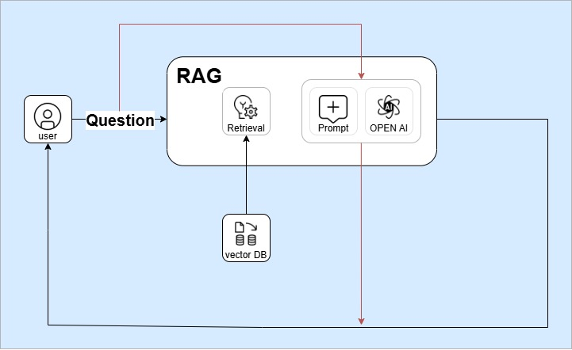

# SKN11-3rd-1Team


<details>
  <summary>📌 목차 </summary>

1. [팀 소개](#팀-소개)  
2. [프로젝트 개요](#프로젝트-개요)  
3. [기술 스택](#기술-스택)  
4. [시스템 아키텍처](#시스템-아키텍처)  
5. [WBS](#wbs)  
6. [요구사항 명세서](#요구사항-명세서)  
7. [수집한 데이터 및 전처리 요약](#수집한-데이터-및-전처리-요약)  
8. [DB 연동 구현 코드](#db-연동-구현-코드)  
9. [모델 선정 이유](#모델-선정-이유)  
10. [테스트 계획 및 결과 보고서](#테스트-계획-및-결과-보고서)  
11. [진행 과정 중 프로젝트 개선 노력](#진행-과정-중-프로젝트-개선-노력)  
12. [수행 결과](#수행-결과)  
13. [한 줄 회고](#한-줄-회고)

</details>


<br/>

# 1. 팀 소개

### 팀명

- **사고 정찰단**


# 🫡 팀원 소개

| 성호진 | 신진슬 | 이채은 | 방성일 | 이선호 |
|--------|--------|--------|--------|--------|
| <br>[GitHub](https://github.com/DawnSurplus)<br>hojin@example.com | <br>[GitHub](https://github.com/SHINJINSEUL)<br>jinsl@example.com | <br>[GitHub](https://github.com/chaeeunlee05)<br>chaeun@example.com | <br>[GitHub](https://github.com/SungilBang12)<br>sungil@example.com | <br>[GitHub](https://github.com/Seonh0)<br>sunho@example.com |


<br/><br/>

# 2. 프로젝트 개요

<aside>

### 프로젝트 명

- 교통사고 과실비율 산정 AI 챗봇 **<노느>**


<p align="center">
  
  
  
</p>


</aside>

### 프로젝트 소개

- 교통사고 발생 시 법률 기준과 판례를 기반으로 **과실비율을 신속하게 산정**해주는 AI 챗봇
- 사용자가 사고 상황을 입력하면, 도로교통법, 대법원 판례 등 **복잡한 법률 자료를 자동으로 분석**하여 기본 과실비율과 그에 대한 판단 근거를 제시함.

<br/>

### 프로젝트 필요성(배경)

1. **과실비율 합의의 어려움**
    
    
    
    <출처 : 과실비율정보포털>
    
    - 기사
        
        https://www.skyedaily.com/news/news_view.html?ID=155657
        
        “이에 따르면 과실비율분쟁 심의를 청구한 운전자의 82.8%가 “내가 피해자”라고 주장했다. 55.7%는 본인이 무과실이라고 여겼고, 81.5%가 서로 다른 사고 원인을 주장했다.”
        
    - 연간 126만 건 이상의 교통사고 발생 시, 당사자 간 주관적 주장으로 인한 분쟁 증가
    - **객관적 기준이 아닌 감정과 오해에 기반한 과실 주장 증가**로 인해, 법적 판단과 다른 무리한 요구가 빈번히 발생하며 공정하고 신속한 과실 산정을 어렵게 만듦
2. 일반인이 이해하기 어려운 법
    - 과실비율이 산정은 전문 지식이 필요한 도로교통법, 민법, 보험약관, 판례 등을 바탕으로 진행
        
        
        
    
    (https://www.kukinews.com/article/view/kuk202208020071)
    
    - 일반인의 이해 한계로 인해 **불공정한 합의가 이뤄질 가능성**이 큼.
3. **판례 검색의 한계**
    - 사고당사자가 수많은 판례 중에서 자신의 상황에 맞는 사례를 직접 검색하고 법리적 근거를 해석하기란 매우 어렵고 시간이 많이 소요됨.
4. **보험사에 대한 불신**
    - 사고 후 보상 절차에서 표준화된 과실비율 판단 기준이 없거나, 설명이 충분하지 않을 경우 당사자 간 신뢰가 무너지고 보험사에 대한 불신이 커짐.
    - 기사
        
        https://www.ddaily.co.kr/page/view/2024101709241277483
        
        “교통사고 현장에서 보험사의 과실비율 짬짜미 때문에 피해보상이 제대로 이뤄지지 않고 있다는 불신이 있다”

<br/>  

### 프로젝트 목표

- 일반 개인이 **사고 상황 입력만으로 근거 있는 과실 비율을 예측하여 신속히 받아볼 수 있는 챗봇** 개발
- **도로교통법, 용어, 판례 등의 설명을 질의응답 형태로 제공하는 챗봇** 개발
- 과실비율 산정의 **객관성, 접근성, 이해도**를 동시에 높이는 사용자 친화적 시스템 구축

<br/><br/>


# WBS


# 요구사항 명세서


<br/><br/>

# 기술 스택 & 사용한 모델 (임베딩 모델, LLM)


| 카테고리 | 기술 스택 |
|----------|------------|
| Language |  |
| Development |  |
| Embedding Model |   |
| Vector DB |  |
| LLM Model |  |
| Framework |   |
| Collaboration Tool |     |


<br/><br/>

# 시스템 아키텍처




<br/>

# 시스템 워크플로우


- 질의 목적 구분(LLM) 문구 추가
- 

<br/><br/>

# 데이터 및 전처리

<aside>

### 출처

- 과실비율 정보포털 (https://accident.knia.or.kr/qnaCase)
    - `231107_과실비율인정기준.pdf` : 교통사고 케이스 별 과실비율 적용 기준, 판례에 대한 자료 명시
- 국가정보센터
    - 도로교통법 ([https://www.law.go.kr/법령/도로교통법](https://www.law.go.kr/%EB%B2%95%EB%A0%B9/%EB%8F%84%EB%A1%9C%EA%B5%90%ED%86%B5%EB%B2%95))

<br/><br/>

# 전처리


- ## `car_to_car.json`
    
   
    ### 📂 판례 JSON 데이터 구조
    
    | **필드명** | **설명** | **데이터 타입** |
    |------------|----------|------------------|
    | `사건 ID`    | 등) | `string` |
    | `사건 제목`  |  2019가단67890 등) | `string` |
    | `기본 과실비율`  | 문 텍스트 | `string` |
    
   
    
    #### 🛠️ 전처리 및 변환 과정

    1. **PDF 사고 상황별로 분류**

    2. **PDF 파일 read**

    3. **머릿말/꼬릿말 제거 후 텍스트 추출**

    4. **수정요소(예: `~참조한다`)는 요약문으로 재정리하여 JSON에 적용**

    5. **없는 값은 `null`로 명시 처리 (예: 참고 판례 없음)**


    <br/>

- ## `precedent.json`
    
    
    ### 📂 판례 JSON 데이터 구조
    
    | **필드명** | **설명** | **데이터 타입** |
    |------------|----------|------------------|
    | `court`    | 판결을 내린 법원명 (예: 대법원, 서울고등법원 등) | `string` |
    | `case_id`  | 사건번호 (예: 2022다12345, 2019가단67890 등) | `string` |
    | `content`  | 판례 요지, 판단 이유 등 본문 텍스트 | `string` |
    

    
   ### 🧾 판례 문서 파싱 단계

    1. **PDF 파일 read 및 텍스트 추출**

    2. **머릿말/꼬릿말 제거**

    3. **`⊙` 기호로 섹션 시작 감지**

    4. **법원명 및 사건 ID 추출**

    5. **내용 수집** (탭 문자 또는 빈 줄 전까지)

    <br/>

- ## `load_traffic_law`
    
    
    ### 📘 도로교통법 JSON 데이터 구조 (`load_traffic_law.json`)
    
    | **필드명** | **설명** | **데이터 타입** |
    |------------|----------|------------------|
    | `조문 제목` | 조문 전체 제목 (예: `"제5조(보행자의 보호)"`) | `string` (key) |
    | `항 번호` | 해당 조문 안의 항목 구분 (예: `"1항"`, `"2항"` 등) | `string` (key) |
    | `항 내용` | 해당 항에 포함된 조문 문장 (한 항에 여러 문장일 수도 있음) | `string[]` |


    
- ## `term`
    
    
    ### 📘 term.json 데이터 구조
    
    | **필드명** | **설명** | **데이터 타입** |
    |------------|----------|------------------|
    | `term`     | 용어명 (예: 도로, 차로, 정차 등) | `string` |
    | `desc`     | 용어에 대한 설명 (1개 이상의 문장으로 구성된 설명 목록) | `string[]` |
    
<br/><br/>

# DB 연동 구현 코드 (링크만)

<aside>

```markdown
[ChromaDB](https://github.com/SKNETWORKS-FAMILY-AICAMP/SKN11-3rd-1Team/blob/main/test/final.ipynb)
```

## **DB 연동 구현 내용**

**구현 내용 요약**

- DB 연동 용으로 `Langchain`의 `Document` 개체로 변환된 데이터
- `OpenAI Embedding` 모델로 벡터화
- `Chroma`기반 Vector DB로 저장하여 RAG 검색 시스템에 최종 연동

<br/><br/>

# 테스트 계획 및 결과 보고서

<aside>

 ## `사고 상황`
 <p align="center">
  
  
</p>

 ## `용어`
 <p align="center">
  
  
</p>

 ## `도로교통법`
 <p align="center">
  
  
</p>

 ## `판례`
 <p align="center">
  
  
</p>


<br/><br/>

# 프로그램 개선 노력

### 1. RAG - self리트리버 사용
    - 호진
### 2. pdf-json 비교검증 → 정확성 향상
    - openai gpt 코드로 pdf 문서를 각 케이스별 상황으로 다 쪼개서 메타데이터 만들어달라
    - 적용 → 비적용 (잘 못 들어감)
    - 일일이 하나하나 검수했다
### 3. 프롬프트 최적화
    
    
    | 번호 | 항목명               | 설명 |
    |------|----------------------|------|
    | 1    | 🧠 질문 분류          | 사용자의 질문을 사고, 법률, 판례, 용어, 일반 다섯 유형 중 하나로 분류하여 흐름을 제어함 |
    | 2    | 🧷 사건 선택 및 연계   | 유사한 사고 사례를 식별하고 사건 ID를 고정 형식으로 출력하여 후속 판단과 연계 |
    | 3    | ⚖️ 사고 판단 자동화    | 문서 기반 사례를 분석해 과실비율과 판단 사유를 자동 도출하며 응답 일관성을 확보 |
    | 4    | 📚 법률 정보 구조화    | 문서 기반 판례, 조문, 용어를 정형화된 형식으로 요약해 전문성과 응답 품질을 향상 |
    | 5    | 💡 일반 지식 대응      | 문서에 없는 질문도 AI의 상식으로 자연스럽고 유연하게 응답 |
    
    
### 4. 파인튜닝

 
    1. 질의 목적 판단
    2. 용어/판례/법률 관련부분 추출
        - <Bllossom/llama-3.2-Korean-Bllossom-3B>, ChromaDB(consine 유사도)
            
            
            
        - <Bllossom/llama-3.2-Korean-Bllossom-3B>, ChromaDB(consine 유사도), qLoRA 파인튜닝
            
            
            
        - saltlux/Ko-Llama3-Luxia-8B>, ChromaDB
            
            
            
    - <saltlux/Ko-Llama3-Luxia-8B>, ChromaDB, qLoRA 파인튜닝
        
        
        
    - <saltlux/Ko-Llama3-Luxia-8B>, ChromaDB(cosine 유사도), qLoRA 파인튜닝
        
        
        
    - <saltlux/Ko-Llama3-Luxia-8B>, FAISS(cosine 유사도), qLoRA 파인튜닝
        
        
        
    - 질문 분류<saltlux/Ko-Llama3-Luxia-8B>, FAISS(cosine 유사도), qLoRA 파인튜닝
        
        
        
<br/><br/>

# 수행결과(테스트/시연 페이지)


<br/><br/>

# 추후 업데이트 계획

1. 파인튜닝
    - 장기적인 비용 절감 목표
        - gpt-4o 최신 토큰 처리 비용이 높다.
        - 비용 절감을 위해 저렴한 모델 사용 또는 무료로 있는 모델→ 파인튜닝
            - 우리가 원하는 동작하는 수준만 되도 gpt-4o (최소 비용감소)
            - gpt-4o 가 큰 비중을 갖는 부분  : 과실비율 계산 수정요소 적용하는 부분

<br/><br/>

# 한 줄 회고

### 호진

- 

### 성일

- 

### 채은

- 

### 진슬

- 

### 선호

- 
</aside>

###
=======
>>>>>>> 13be2a0e3083895d2cc717bece04bd7195aba7fd
